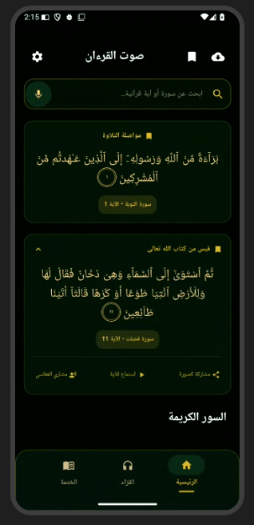
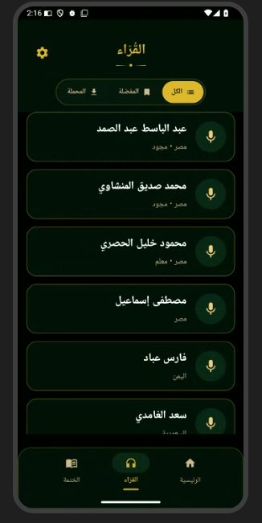
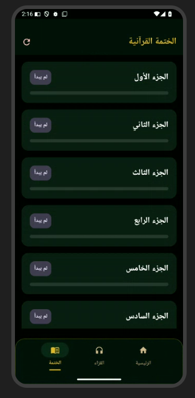

# Sawt AL Quran

**Version: 3.0.0**  
**Developer: Architect Mohammed Shaheed Al-Ajajibi**

> **Sawt AL Quran** is a religious Quran application designed to provide a calm, elegant, and simple digital experience for listening to the Holy Quran, reading and following verses, and tracking Quran Khatmah progress. The application is especially useful for maintaining a structured Quran routine during the holy month of Ramadan.

## About the App

**Sawt AL Quran** brings essential Quran experiences together in one focused application. It allows users to listen to Quran recitations, browse available reciters, read Quranic verses, follow the recitation through visual verse highlighting, and track their progress toward completing the Quran.

The application was designed with a modern Islamic visual identity, combining a dark interface with deep green surfaces and subtle gold accents to create a peaceful and focused reading and listening environment.

## Key Features

- 🎧 **Listen to the Holy Quran** through a selection of available reciters.
- 🎙️ **Browse Reciters** and choose a preferred recitation.
- 📖 **Read the Holy Quran** through a dedicated reading experience.
- ✨ **Verse Highlighting** to visually follow the verse being recited.
- 📚 **Quran Khatmah Tracking** to follow progress through the Quran by Juz'.
- 🌙 **Ramadan-Friendly Experience** designed to support a consistent Quran routine throughout the month.
- 🔎 **Search and Navigation** for easier access to Quran content.
- 🕋 **Modern Islamic UI** with a calm dark-green and gold-inspired visual style.
- 📌 **Simple Arabic Interface** focused on clarity, readability, and ease of navigation.

## Main Screens

### 1. Home — Sawt AL Quran

The home screen provides quick access to Quran content, search, featured verses, and listening experiences in a focused and elegant interface.



### 2. Reciters

A dedicated reciters screen allows users to browse available Quran reciters and select the voice they prefer for listening.



### 3. Quran Khatmah

The Khatmah screen helps users monitor Quran completion progress by displaying the Juz' sequence and the status of each part. This feature is particularly valuable for building a structured reading plan during Ramadan.



## Project Information

| Item | Details |
|---|---|
| **App Name** | Sawt AL Quran |
| **Version** | `3.0.0` |
| **Category** | Religious / Quran Application |
| **Developer** | Architect Mohammed Shaheed Al-Ajajibi |
| **Primary Language** | Arabic |
| **Design Direction** | Modern Islamic UI |
| **Main Purpose** | Quran listening, reading, verse following, and Khatmah tracking |

## Project Goals

The goal of **Sawt AL Quran** is to make interaction with the Holy Quran more accessible through a unified digital experience. Instead of separating listening, reading, and completion tracking, the application brings these activities together in a simple and peaceful interface.

A major focus of the application is supporting users in maintaining a daily Quran routine, particularly during **Ramadan**, when many users aim to complete one or more Khatmahs during the holy month.

## Design Philosophy

The visual language of Sawt AL Quran is intentionally calm and minimal. The interface uses dark surfaces, deep green tones, rounded components, and restrained gold accents to create a respectful Islamic atmosphere without overwhelming the Quran content itself.

The design prioritizes:

- Clarity and readability
- Minimal visual distraction
- Fast access to Quran content
- Comfortable navigation
- A cohesive Islamic visual identity

## Repository Structure

```text
quran_voice_v3/
├── README.md
├── README_AR.md
└── screenshots/
    ├── 01-home.png
    ├── 02-reciters.png
    └── 03-khatmah.png
```

## Screenshots

The `screenshots` directory contains selected application interface previews for documentation and project presentation purposes.

## Developer

**Architect Mohammed Shaheed Al-Ajajibi**  
Developer and designer of **Sawt AL Quran — Version 3.0.0**.

## Copyright

© 2026 Architect Mohammed Shaheed Al-Ajajibi. All rights reserved unless otherwise stated in the project files.
